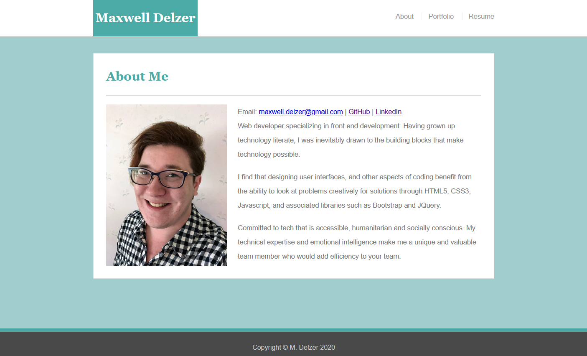
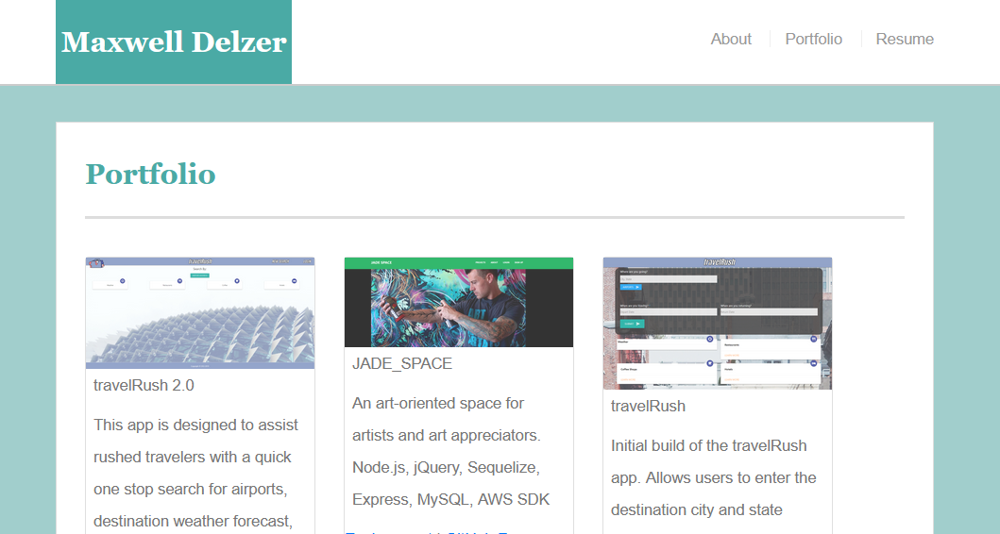
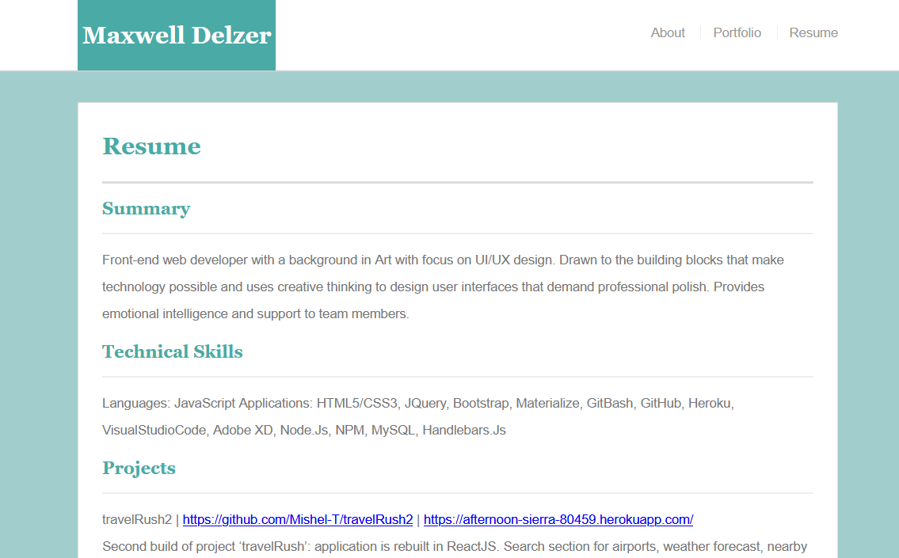

# Portfolio3.0

This is the web portfolio of Maxwell Delzer, Front-end Developer and UI Designer.

* Made with `HTML5`, `CSS3`, `Bootstrap 4.4.1`, and `Reset CSS`

## How to Navigate:

* Go to <https://delzerbear.github.io/Portfolio3.0/index.html>
* You will be at the `About` page.

Using the Navbar in the Header, you can go to the other pages.

`Portfolio` will display previous solo and group projects including:
* Image thumbnail
* Brief description of app
* Technologies
* GitHub repo link, and active link to environment*. (*Node.js projects will not have this feature.)

`Resume` will display in-page resume.

